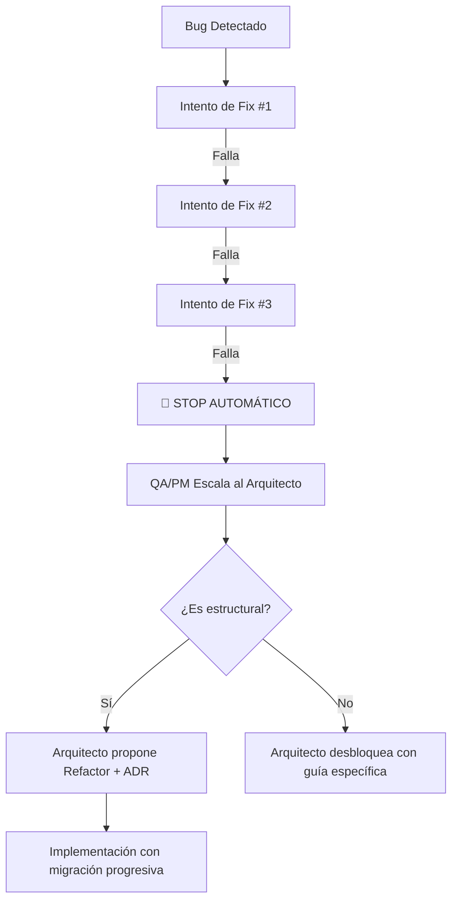

# 🏛️ Software Architecture Patterns (Skill)

Esta es la base de conocimientos y herramientas principales para el agente **Dev-Architect** de Syrtix. Contiene los modelos estándar comprobados para crear aplicaciones web robustas.

## 📦 Contenido de esta Skill

### 1. Plantillas de Bases de Datos (PocketBase/SQL)
Ubicación: `resources/pocketbase-crm-schema.json`
- Utiliza esta plantilla como punto de partida cuando el usuario solicite un CRM o sistema de gestión de usuarios. Incluye manejo de roles, seguridad básica y relaciones.

### 2. Estándares de Código Limpio (Clean Code & Modular Data)
Ubicación: `resources/clean-code-standards.md`
- Define la ley de Syrtix: **Feature-Based Architecture** obligatoria y la **Estrategia de Modular Data** para bilingüismo y escalabilidad. Prohíbe el hardcoding de contenido denso.

### 3. Checklists de Seguridad (Security Guardrails)
Ubicación: `resources/security-guardrails.md`
- Contiene las validaciones obligatorias de seguridad antes de autorizar código de producción.

### 4. Planos de Código Seguro (Security Blueprints)
Ubicación: `resources/security-blueprints.md`
- Fragmentos de código listos para usar (Helmet, CORS, JWT, Rate-limit) para Node.js/Express.

## 🏗️ Architecture Decision Records (ADR)

### ¿Cuándo crear un ADR?
- Cambio de stack tecnológico o framework
- Elección de patrón de estado (Zustand vs Context vs Redux)
- Decisión de arquitectura de base de datos
- Escalación de la Regla de los 3 Fallos (refactor estructural)
- Cualquier decisión que afecte a más de 3 archivos

### Plantilla ADR
```markdown
# ADR-[NNN]: [Título de la Decisión]

**Fecha:** YYYY-MM-DD
**Estado:** [Propuesto | Aceptado | Rechazado | Reemplazado por ADR-XXX]
**Autores:** [Quién propone]

## Contexto
¿Qué problema o necesidad motiva esta decisión?

## Decisión
¿Qué se decidió hacer?

## Alternativas Evaluadas
| Alternativa | Pros | Contras | Descartada porque |
|---|---|---|---|
| Opción A | ... | ... | ... |
| Opción B | ... | ... | ... |

## Consecuencias
- **Positivas:** [Qué mejora]
- **Negativas:** [Qué trade-offs aceptamos]
- **Riesgos:** [Qué podría salir mal]

## Seguimiento
- [ ] Implementar en Sprint N
- [ ] Verificar con QA
- [ ] Documentar cambios en README
```

## 🚨 Protocolo de Escalación (Regla de los 3 Fallos)

### Flujo de Escalación


### Indicadores de Problema Estructural
Si el fix requiere alguno de estos, es **estructural:**
- Tocar más de 3 archivos no relacionados
- Importar una dependencia que no existía para parchear algo
- Duplicar lógica para "evitar" el bug
- Hacer un `if` especial que solo aplica a un caso raro
- Convertir un componente simple en uno de 200+ líneas

## 📐 Technology Decision Matrix
Para cada proyecto nuevo, evaluar:

| Criterio | Pregunta Clave | Si SÍ → | Si NO → |
|---|---|---|---|
| **SSR/SEO** | ¿Necesita indexación o OG previews? | Next.js | Vite SPA |
| **Auth** | ¿Necesita login/registro? | PocketBase Auth / NextAuth | Sin auth |
| **Estado Global** | ¿Estado compartido entre +3 componentes? | Zustand | useState/useReducer |
| **Real-time** | ¿Datos en vivo? | WebSockets / SSE | REST API polling |
| **Seguridad RSC** | ¿React 19 + RSC? | Verificar CVE-2025-55182 | Irrelevante |
| **Animaciones** | ¿Necesita WOW visual? | GSAP + Framer Motion + Lenis | CSS transitions |

### 🗄️ Guía de Decisión de Base de Datos (Syrtix)

> **Regla de Oro:** PocketBase y Supabase son sistemas de **producción**, no de prototipado. El 95% de los proyectos de agencia web se resuelven con BaaS (Backend-as-a-Service). Usar PostgreSQL+Prisma crudo solo se justifica para requisitos enterprise muy específicos.

| Backend | Motor Real | Ideal Para | Despliegue en Coolify | Peso/RAM |
|---|---|---|---|---|
| **PocketBase** | SQLite embebido | CRM, booking, portfolios, landing+forms, dashboards simples | ⭐ Perfecto — 1 binario Go en Docker | ~30MB / ~50MB RAM |
| **Supabase** | PostgreSQL completo | E-commerce, apps con roles complejos, dashboards con datos pesados, multi-tenant | ✅ Self-hosted con Docker Compose | ~2GB+ RAM |
| **PostgreSQL + Prisma** | PostgreSQL raw | Solo cuando el cliente EXIGE control total: stored procedures, replicación multi-región, compliance enterprise | ✅ PostgreSQL en Docker + app Node.js | Variable |

**¿Cuándo usar cada uno?**

```
¿El proyecto tiene < 50 tablas y roles simples? 
  → PocketBase (una sola imagen Docker, ultra rápido)

¿El proyecto necesita PostgreSQL avanzado (RLS, edge functions, real-time nativo)?
  → Supabase (PostgreSQL + superpoderes incluidos)

¿El cliente exige control raw de la DB, migraciones manuales, stored procedures?
  → PostgreSQL + Prisma (tú manejas todo)
```

**⚠️ NUNCA digas "PocketBase = MVP" o "Supabase = juguete".** Ambos son producción. Syrtix ya opera TattooStudio en producción con PocketBase, y Supabase es PostgreSQL por dentro (la misma DB que usan Instagram, Spotify y Discord).

## 🖼️ Estrategia de Assets (Imágenes y Video)

Para maximizar la rentabilidad de la agencia y el rendimiento de la web, Syrtix sigue un protocolo estricto de autogestión de archivos:

### 🛠️ Protocolo: MinIO + Optimización Progresiva
> **Regla de Oro:** Solo usar Cloudinary si el presupuesto del cliente es masivo y explícitamente lo solicita. Para el resto de proyectos, hostear en **Hetzner + Coolify**.

1.  **Almacenamiento:** Uso de **MinIO** (S3-Compatible) instanciado en Coolify.
2.  **Optimización en Servidor:** Antes de subir a MinIO, el backend (Node.js) **DEBE** procesar la imagen usando la librería `Sharp`.
    *   **Formato:** Convertir siempre a `.webp` o `.avif`.
    *   **Calidad:** Reducir a un factor de 0.8 (80%).
    *   **Resizing:** Generar versiones `thumbnail`, `medium` y `large` (Responsive Images).
3.  **Video:** No subir videos pesados directamente a la base de datos o MinIO sin compresión. Usar plugins de compresión o servicios como Mux/Vimeo solo para video masivo; para video de fondo, compresión manual con `ffmpeg` y hostear en MinIO.

**¿Por qué hacemos esto?**
- **Cero Costos Recurrentes:** No pagamos facturas de Cloudinary.
- **Márgenes de Agencia:** Puedes cobrar el "Hosting de Imágenes" como un servicio adicional sin que a ti te cueste más que unos GB de disco duro en Hetzner.

## ⚙️ Cómo usar esta Skill
- Cuando se te pida diseñar una base de datos para retención de clientes o gestión, lee inmediatamente el archivo de la plantilla del CRM.
- Al revisar PRs o proponer implementaciones, valida el código contra el `security-guardrails.md` y asegura el cumplimiento de la regla de **Gestión de Contenidos Híbrida** en `clean-code-standards.md`.
- Cuando se active el protocolo de escalación, documenta la decisión con un ADR.

## 🛠 Puntos de Integración con el Sistema
- **Infraestructura:** Todos los diseños asumen un despliegue mediante Docker en **Hetzner + Coolify**. Priorizar imágenes Docker livianas y configuraciones que Coolify pueda manejar nativamente.
- **Frontend Stack:** La arquitectura backend diseñada debe favorecer el consumo mediante React (Vite SPA o Next.js). Si se elige Next.js con Server Components, se **DEBE** verificar primero que las versiones de React y paquetes RSC estén parcheadas contra CVE-2025-55182. Consultar `security-guardrails.md` → Sección 6 antes de aprobar la arquitectura.
- **Coordinación con QA:** El Arquitecto recibe escalaciones del QA Tester vía la Regla de los 3 Fallos y responde con ADRs.
- **Coordinación con Frontend:** Las decisiones de animación y UI deben estar validadas contra `syrtix-ui-system` y `syrtix-wow-animations`.

