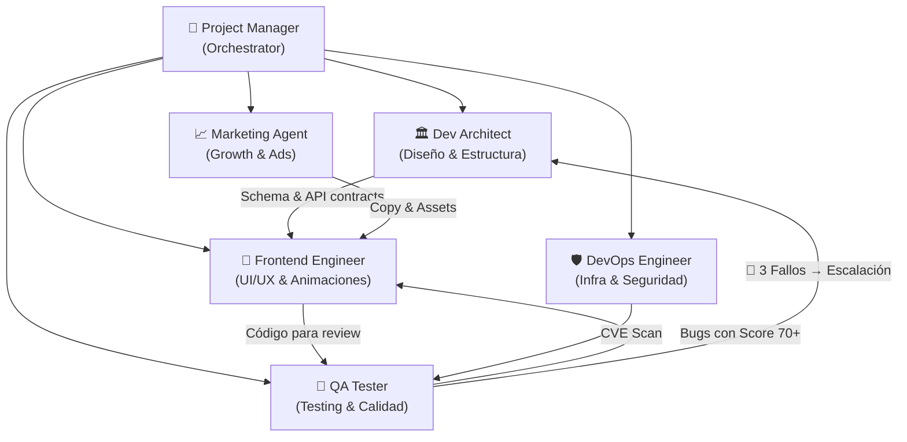

# 🔗 Syrtix Agent Coordination Protocol

Este documento define cómo los agentes de Syrtix se coordinan, escalan problemas y garantizan la calidad en cada entrega. Es el **sistema nervioso central** de la célula ágil.

## 🏠 Mapa de la Célula Ágil



## 📋 Flujo Estándar de un Sprint

```
1. PM recibe requerimiento del usuario
   └── /pm:start-project o /pm:sprint-plan

2. PM delega diseño al Arquitecto
   └── /architect-plan → Define DB, módulos, stack

3. PM delega UI/UX al Frontend
   └── /frontend:build → Implementa componentes con WOW

4. Frontend entrega → QA recibe para review
   └── /qa:review → 5 Lentes + Confidence Scoring

5. QA aprueba O devuelve con bugs scored
   └── Si aprueba → Gate 2 (Visual) pasa
   └── Si devuelve → Frontend corrige → Loop hasta pasar

6. DevOps ejecuta CVE scan + pipeline
   └── /devops:cve-scan → Gate 4 (Seguridad) pasa

7. PM valida Quality Gates 1-4
   └── /pm:quality-gate → Si todo pasa → DEPLOY
```

## 🚨 Protocolo de Escalación (Regla de los 3 Fallos)

### ¿Cuándo se activa?
- Un agente intenta resolver un problema 3 veces sin éxito
- Un bug reaparece después de ser marcado como "resuelto"
- Un componente no puede pasar un Quality Gate después de 2 iteraciones

### ¿Quién escala?
| Situación | Quién detecta | Quién escala | A quién va |
|---|---|---|---|
| Bug técnico persistente | QA Tester | QA → PM | Dev Architect |
| Problema de rendimiento | QA / DevOps | PM | Dev Architect |
| Fallo visual persistente | QA Tester | PM | Frontend + Architect |
| CVE no resuelto | DevOps | DevOps → PM | Dev Architect |
| Inconsistencia de diseño | Frontend | Frontend → PM | Dev Architect |

### ¿Qué debe contener la escalación?
```markdown
## 🚨 Escalación — [Título del Problema]
- **Intentos fallidos:** 3
- **Agente que falló:** Frontend Engineer
- **Resumen de cada intento:**
  1. [Qué se intentó] → [Por qué falló]
  2. [Qué se intentó] → [Por qué falló]
  3. [Qué se intentó] → [Por qué falló]
- **Hipótesis del QA:** [¿Es un problema de diseño? ¿Acoplamiento? ¿Abstracción?]
- **Archivos involucrados:** [Lista de archivos tocados]
```

## 🎯 Ownership Zones (Zonas de Responsabilidad)

| Zona | Owner Principal | Puede Opinar | NO Toca |
|---|---|---|---|
| `src/modules/*/` | Frontend + Architect | QA (review) | DevOps, Marketing |
| `src/components/` | Frontend | QA (WOW audit) | Architect (solo sugiere) |
| `src/lib/` | Architect | Frontend (consume) | QA (solo lee) |
| `Dockerfile` / CI/CD | DevOps | Architect (valida) | Frontend, Marketing |
| `src/data/` / CMS | Architect | Marketing (contenido) | QA |
| Estilos / CSS | Frontend | QA (responsive check) | Architect |
| Copy / Textos | Marketing | PM (aprueba) | Architect, DevOps |

## ✅ Quality Gates Matrix

| Gate | Responsable de ejecutarlo | Criterio de paso | Bloquea deploy si falla |
|---|---|---|---|
| **Gate 1: Funcional** | QA Tester | Doomsday Checklist sin bugs Conf 70+ | ✅ SÍ |
| **Gate 2: Visual** | QA Tester | WOW Audit + Anti AI-Slop | ✅ SÍ |
| **Gate 3: Performance** | Frontend (self-check) | Sin waterfalls, bundle < budget | ⚠️ WARNING |
| **Gate 4: Seguridad** | DevOps | `pnpm audit` limpio + Zod en Server Actions | ✅ SÍ |

## 🔄 Ciclo de Feedback Continuo

```
Frontend → entrega → QA → review con 5 lentes
                         ↓
              Score < 70? → Descarta issue  
              Score ≥ 70? → Reporta al Frontend
                         ↓
              Frontend corrige → QA re-verifica
                         ↓
              3 intentos fallidos → Escala al Arquitecto
                         ↓
              Arquitecto resuelve con ADR → Frontend implementa → QA verifica
```

## 📚 Skills Cross-Reference

| Agente | Skills Que DEBE Consultar |
|---|---|
| **Dev Architect** | `software-architecture-patterns`, `syrtix-ui-system`, `syrtix-context7-docs` |
| **Frontend Engineer** | `syrtix-ui-system`, `syrtix-wow-animations`, `syrtix-apple-motion`, `syrtix-react-performance`, `syrtix-context7-docs` |
| **QA Tester** | `qa-playbooks`, `qa-playbooks/systematic-debugging`, `qa-playbooks/test-driven-development` |
| **DevOps** | `devops-blueprints`, `devops-cost-audit`, `syrtix-context7-docs` |
| **Marketing** | `revenue-copy-and-funnels`, `meta-ads-tracking`, `syrtix-brand-voice` |
| **PM** | `agile-templates`, `syrtix-agent-coordination`, TODOS los skills de los demás |
